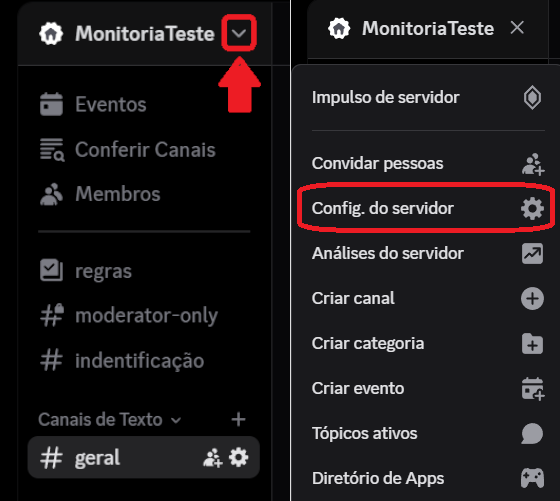

## Adicione o bot ao servidor

Clique neste [link](https://discord.com/oauth2/authorize?client_id=1345088049192636538&permissions=8&integration_type=0&scope=bot) para receber acesso ao bot. Escolha o servidor em que quer adiciona-lo e clique em **Continuar**. Tenha certeza que está concedendo ao bot as permissões de um Administrador, e clique em **Autorizar**.

## Crie um cargo de administrador

Caso ainda não tenha, crie um cargo para aqueles que serão os administradores do seu servidor. Você pode fazer isso primeiro acessando as configurações do seu servidor.

Após isso, vá em **Cargos** e clique em **Criar cargo**. Dê o nome "Admin" ou que preferir, vá em **Permissões**, digite "adm" na barra de pesquisa, a permissão de **Administrador** vai aparecer, confirme ela. Vá em **Gerenciar Membros** e adicione os membros que se tornarão administradores. Antes de sair, não esqueça de clicar em **Salvar alterações**!

## Utilize o comando para definir o cargo (Adm)

Para ter o cargo de Administrador ser reconhecido pelo bot, vá em um canal do servidor (de preferência um dedicado a comandos) e digite "/conf".  Vão aparecer várias opções de comandos, escolha o comando `/configurar cargo_de_administrador`. Após isso, escolha o cargo de Administrador. Aperte Enter.

## Crie um cargo de monitor

Mesmo processo que o cargo de Administrador. A única diferença é que Monitores não terão as mesmas permissões que Admins.

## Utilize o comando para definir o cargo (Monitor)

Mesmo processo que o cargo de Administrador. Mas dessa vez você escolherá o comando `/configurar cargo_de_monitor` e depois o cargo de Monitor.

## Crie um canal de fórum

Caso ainda não tenha habilitado o seu servidor como comunidade, vá para as configurações do seu servidor novamente. Vá em **Habilitar comunidade** e clique em **Começar agora**. Habilite o "Nível De Verificação" e "Filtro De Conteúdo De Mídia Explícita" e clique em **Próximo**. Defina o seus canais de regras e atualizações, ou deixe o Discord criá-los para você, **Próximo**. Clique em **Concordo e entendo**, e depois em **Terminar configuração**.

Agora, crie um fórum para o canal de dúvidas.

## Utilize o comando para definir o canal de dúvidas

Mesmo processo que o cargos. Mas dessa vez você escolherá o comando `/configurar canal_do_forum` e depois o canal de fórum.

## Crie a tag de resolvido

